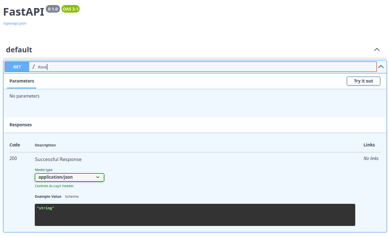

# pymll

## 🚀 Kluczowe usprawnienia:

### 1. **Lepsze modele LLM zoptymalizowane pod kątem kodu**:
- **qwen2.5-coder:7b** - Najlepszy do JSON i strukturalnego kodu
- **deepseek-coder:6.7b** - Specjalizowany w generowaniu kodu
- **codellama:7b/13b** - Meta's model, świetny bilans jakości
- **granite-code:8b** - IBM, dobry do kodu enterprise

### 2. **Wsparcie dla 13+ frameworków**:
- Frontend: Express, Next.js, React, Vue
- Backend: FastAPI, Django, Flask, Spring Boot, ASP.NET
- API: FastAPI, Gin, Express, Actix
- Workers: Python, Go, Rust

### 3. **Architektura obiektowa** - czytelniejsza i łatwiejsza w utrzymaniu

### 4. **Wbudowane testy jednostkowe** 

### 5. **Inteligentna sanityzacja** - automatyczna naprawa JSON/YAML

## 📦 Instalacja i pierwsze użycie:

```bash
# 1. Zainstaluj wymagania
pip install pyyaml requests

# 2. Zainstaluj wybrany model (polecam qwen2.5-coder)
ollama pull qwen2.5-coder:7b
# lub
ollama pull deepseek-coder:6.7b

# 3. Nadaj uprawnienia i uruchom
chmod +x ymll.py

# 4. Inicjalizacja projektu
./ymll.py init

# 5. Generowanie kodu z wyborem frameworków
./ymll.py generate "E-commerce API z koszykiem i płatnościami" \
  --frameworks "frontend:nextjs,backend:fastapi,api:gin,workers:python"

# 6. Uruchomienie z self-healing
./ymll.py run
```


## 🔧 Konfiguracja modelu:

Edytuj `ymll.config.yaml` po inicjalizacji:

```yaml
llm:
  model: qwen2.5-coder:7b  # Zmień na preferowany
  temperature: 0.2          # Niższe = bardziej deterministyczne
  max_tokens: 8192          # Więcej tokenów dla większych projektów
```


```shell
$ ./ymll.py init
2025-09-25 11:20:05,306 - INFO - 🎯 Inicjalizacja projektu YMLL v3...
2025-09-25 11:20:05,308 - INFO - ✅ Projekt zainicjalizowany

$ ./ymll.py generate "Simple product API" \
  --frameworks "frontend:express,backend:fastapi"
2025-09-25 11:20:19,058 - INFO - 🚀 Generowanie iteracji: Simple product API
2025-09-25 11:20:19,059 - INFO - 📞 Wywołanie modelu: qwen2.5-coder:7b
2025-09-25 11:20:25,135 - INFO - 🔍 Rozpoczynam parsowanie odpowiedzi LLM...
2025-09-25 11:20:25,135 - INFO - 🔍 Testuję 5 wzorców JSON...
2025-09-25 11:20:25,135 - INFO - ✅ Pomyślnie sparsowano JSON metodą 'markdown_json_block'
2025-09-25 11:20:25,135 - INFO - 📊 Znaleziono 2 komponentów
2025-09-25 11:20:25,135 - INFO -   - frontend (frontend/express): 2 plików
2025-09-25 11:20:25,136 - INFO -   - backend (backend/fastapi): 2 plików
2025-09-25 11:20:25,136 - INFO - 🎯 Użyto metody parsowania: markdown_json_block
2025-09-25 11:20:25,136 - INFO - 💾 Zapisano komponenty do: iterations/01_simpleproductapi/components.json
2025-09-25 11:20:25,136 - INFO - 🔨 Rozpoczynam generowanie plików komponentów...
2025-09-25 11:20:25,136 - INFO - 🔨 Generuję komponent 1/2: frontend
2025-09-25 11:20:25,136 - INFO -   ✅ Utworzono: iterations/01_simpleproductapi/frontend/server.js
2025-09-25 11:20:25,136 - INFO -   ✅ Utworzono: iterations/01_simpleproductapi/frontend/package.json
2025-09-25 11:20:25,136 - INFO -   ✅ Utworzono Dockerfile dla frontend
2025-09-25 11:20:25,136 - INFO - 🔨 Generuję komponent 2/2: backend
2025-09-25 11:20:25,136 - INFO -   ✅ Utworzono: iterations/01_simpleproductapi/backend/main.py
2025-09-25 11:20:25,137 - INFO -   ✅ Utworzono: iterations/01_simpleproductapi/backend/requirements.txt
2025-09-25 11:20:25,137 - INFO -   ✅ Utworzono Dockerfile dla backend
2025-09-25 11:20:25,137 - INFO - ✅ Parsowanie i generowanie plików zakończone pomyślnie
2025-09-25 11:20:25,137 - INFO - 🔍 Walidacja iteracji...
2025-09-25 11:20:25,137 - INFO -   ℹ️ Opcjonalny katalog api jest pusty
2025-09-25 11:20:25,137 - INFO -   ℹ️ Opcjonalny katalog workers jest pusty
2025-09-25 11:20:25,137 - INFO -   ✅ Walidacja pomyślna
2025-09-25 11:20:25,137 - INFO - ✅ Iteracja 01_simpleproductapi wygenerowana pomyślnie
2025-09-25 11:20:25,138 - INFO - ✅ Docker Compose zaktualizowany

$ ./ymll.py run
2025-09-25 11:21:04,513 - INFO - 🔄 Uruchamianie self-healing workflow...
2025-09-25 11:21:04,513 - INFO - 🎯 Uruchamianie iteracji: 01_simpleproductapi
2025-09-25 11:21:04,513 - INFO - ========== Próba 1/5 ==========
2025-09-25 11:21:09,234 - INFO - 🐳 Docker Compose uruchomiony
2025-09-25 11:21:19,328 - INFO -   Frontend: ✅
2025-09-25 11:21:19,333 - INFO -   Backend: ✅ (http://localhost:3100/docs)
2025-09-25 11:21:19,333 - INFO - ✅ Wszystkie testy przeszły pomyślnie!
```

[http://localhost:3100/docs](http://localhost:3100/docs)



### 🧹 Teraz wyczyść i uruchom od nowa:

```bash
# 1. Zatrzymaj wszystko
docker-compose down
docker stop $(docker ps -aq)

# 2. Wyczyść stare iteracje
rm -rf iterations/*
rm -f docker-compose.yml

# 3. Zainicjuj od nowa
./ymll.py init

# 4. Wygeneruj prostszy projekt (test podstawowy)
./ymll.py generate "Simple product API" \
  --frameworks "frontend:express,backend:fastapi"

# 5. Sprawdź co wygenerowano
ls -la iterations/*/
cat iterations/*/backend/main.py
cat iterations/*/backend/Dockerfile

# 6. Uruchom
./ymll.py run
```

### 📊 Debugowanie jeśli coś nie działa:

```bash
# Sprawdź logi dokładnie
docker-compose logs backend
docker-compose logs api

# Test ręczny backend
docker-compose exec backend sh
# w kontenerze:
python -c "import main; print(main.app)"
uvicorn main:app --host 0.0.0.0 --port 3100

# Sprawdź porty
docker-compose ps
netstat -tulpn | grep -E "3003|3100|3200"
```


## 🧪 Przykładowe przypadki użycia:

### Przypadek 1: Microservices z różnymi technologiami
```bash
./ymll.py generate "System mikrousług z autentykacją JWT" \
  --model qwen \
  --frameworks "frontend:nextjs,backend:spring,api:fastapi,workers:go"
```

### Przypadek 2: Full-stack JavaScript
```bash
./ymll.py generate "Real-time chat application" \
  --model codellama \
  --frameworks "frontend:nextjs,backend:nestjs,api:express,workers:python"
```

### Przypadek 3: High-performance backend
```bash
./ymll.py generate "High-throughput data processing pipeline" \
  --model deepseek \
  --frameworks "frontend:express,backend:actix,api:gin,workers:rust"
```

## 🔬 Uruchomienie testów:

```bash
# Uruchom wbudowane testy jednostkowe
./ymll.py test

# Output:
# test_framework_registry ... ok
# test_init_project ... ok
# test_sanitize_json ... ok
# test_validate_iteration ... ok
# ✅ Wszystkie testy przeszły pomyślnie
```

## 🎯 Przykład wygenerowanego kodu:

System automatycznie generuje poprawny, działający kod dla wybranego frameworka:

**FastAPI (Python)**:
```python
from fastapi import FastAPI, HTTPException
from pydantic import BaseModel
from typing import List

app = FastAPI()

class Product(BaseModel):
    id: int
    name: str
    price: float

products = []

@app.get("/api/v1/products", response_model=List[Product])
async def get_products():
    return products

@app.post("/api/v1/products", response_model=Product)
async def create_product(product: Product):
    products.append(product)
    return product
```

**Gin (Go)**:
```go
package main

import (
    "net/http"
    "github.com/gin-gonic/gin"
)

type Product struct {
    ID    int     `json:"id"`
    Name  string  `json:"name"`
    Price float64 `json:"price"`
}

var products []Product

func main() {
    r := gin.Default()
    
    r.GET("/api/v1/products", func(c *gin.Context) {
        c.JSON(http.StatusOK, products)
    })
    
    r.POST("/api/v1/products", func(c *gin.Context) {
        var product Product
        if err := c.ShouldBindJSON(&product); err != nil {
            c.JSON(http.StatusBadRequest, gin.H{"error": err.Error()})
            return
        }
        products = append(products, product)
        c.JSON(http.StatusCreated, product)
    })
    
    r.Run(":8080")
}
```


## Aktualny stan

1. **Lepsza obsługa błędów** - try/except zamiast bash-owych pułapek
2. **Łatwiejsze parsowanie JSON/YAML** - natywne biblioteki
3. **Walidacja schematów** - możliwość użycia jsonschema
4. **Logging** - profesjonalne logowanie z poziomami
5. **Testowanie** - wbudowane unittest
6. **Rozszerzalność** - łatwe dodawanie nowych frameworków
7. **Cross-platform** - działa na Windows/Linux/Mac
8. 
1. **Lepsze parsowanie JSON z LLM** - obsługa różnych formatów i usuwanie znaków kontrolnych
2. **Normalizacja nazw warstw** - automatyczna zamiana "worker" → "workers"
3. **Poprawione Dockerfiles** - właściwe porty dla każdej warstwy (3003, 3100, 3200)
4. **Lepsza walidacja** - tylko frontend i backend są wymagane, api/workers są opcjonalne
5. **Next.js package.json** - automatyczne dodawanie brakujących skryptów build/start
6. **FastAPI E2E testy** - testowanie wielu endpointów including /docs

1. **Backend FastAPI** uruchamia się na porcie (3100)
2. **API FastAPI** uruchamia się na porcie 3200
3. **Walidacja** nie wymaga wszystkich warstw
4. **Testy E2E** sprawdzają różne endpointy FastAPI (/, /docs, /api/status)
5. **Normalizacja** naprawia błędy w nazwach warstw z LLM

Gdy model generuje nieprawidłowy JSON, fallback zapewnia podstawową funkcjonalność.
Jeśli nadal będą problemy, sprawdź dokładne logi z `docker-compose logs backend`
